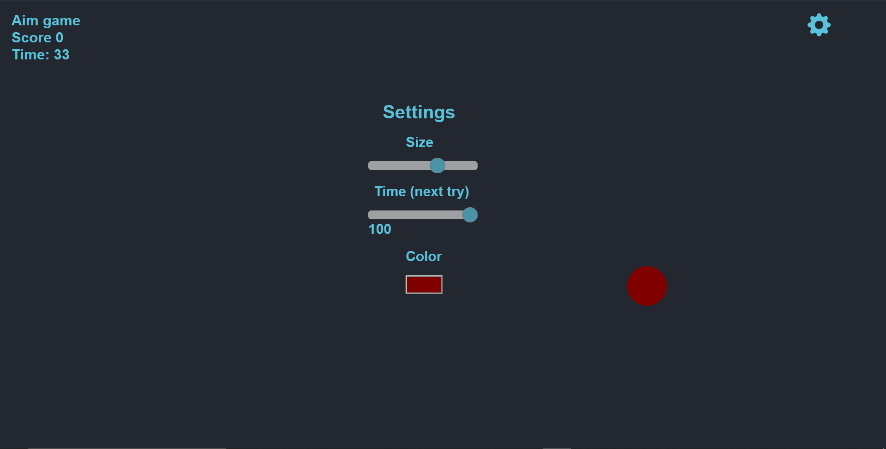

# 🎯 Aim Game

A simple browser-based game created in 3 hours while learning the basics of JavaScript.

---

## Technologies Used

-  HTML5  
-  CSS3  
-  JavaScript (Vanilla JS, no libraries)

---



---
## Run Locally
 ```bash
 https://github.com/OleksandrVozhdai/aim-game-js.git
```
 Launch index.html in your browser
